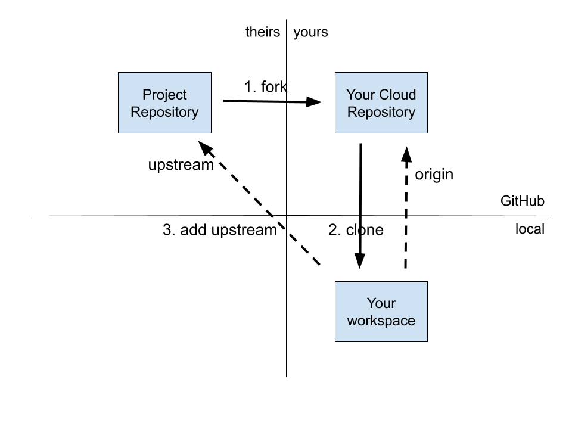

\newpage
# Clone

Most open source projects allow you to contribute to the project without being a member of their development team. A _committer_ is someone who has development privileges for their source repository. A committer can make changes to their source repository. A _contributor_ may propose code changes. In this tutorial, we will assume you are a contributor, not a committer.

To start collaborating on an existing project, you need to `fork` the project to your GitHub account and then `clone` that repository to your local machine.

```bash
# Fork is an operation that you perform in a browser.
# Then you clone your copy of the repository
git clone your-repository.git
# Add a reference to the original source repository.
git add upstream repository.git
```

The original project repository is referenced as `upstream`. Your fork of that repository is referenced as `origin`.

## Figure 1. Fork and clone a repository

