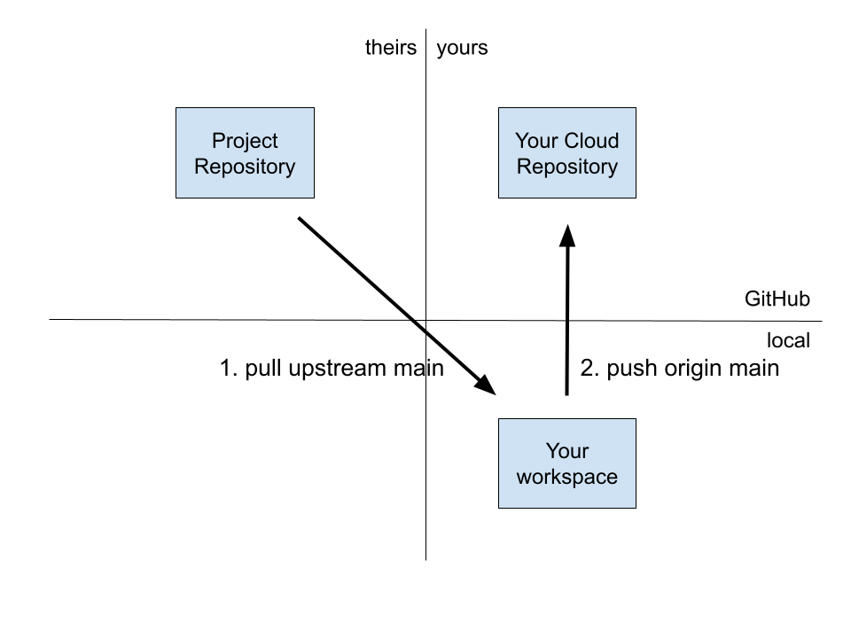

\newpage
# Pull

Many people will be collaborating on the project and you will want to pull other people's changes into your local repository. You do that by _pulling_ changes from the `main` branch.

The [pull](https://git-scm.com/docs/git-pull) command incorporates changes from a remote repository into the current branch.

```bash
git pull upstream main
```

## Pull changes from the project repository


You have to synchronize your `origin` repository manually with the `upstream` repository, even though `origin` is a fork of `upstream`. GitHub does _not_ keep your fork synchronized for you automatically.
