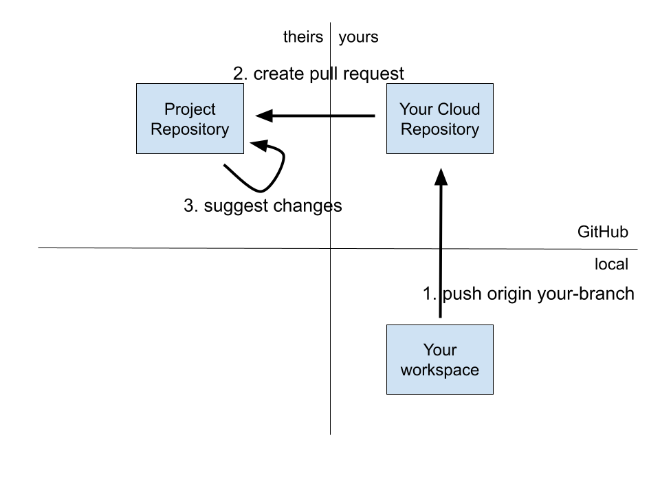

\newpage
# Create a Pull Request

After making some changes to your code base, you want to make your changes available for review, so that they can be incorporated into the project repository. First, you commit the changes to your local repository. Then you push the changes to your cloud repository. Then you create a pull request, offering your changes to the project repository. At that point, the project team reviews your changes. They may suggest changes, in which case you make another round of changes, commit, and push those changes. GitHub incorporates this second set automatically into your pull request.

The following code adds all of the changed and new files from the current directory to the "staged" files, then commits those staged files, and pushes the `add-scatter-plot` branch to the `origin` repository:

```bash
git add .
git commit
git push origin add-scatter-plot
# You create a pull request from a browser
```
## Push changes to your repository in the cloud


You repeat the `add`, `commit`, and `push` steps as many times as needed to respond to the reviewers' suggestions. However, you only need to create the pull request once. After that, GitHub automatically updates the pull request each time you push that same branch to the `origin` repository.

## Command Reference
* [add](https://git-scm.com/docs/git-add)
* [commit](https://git-scm.com/docs/git-commit)
* [push](https://git-scm.com/docs/git-push)
