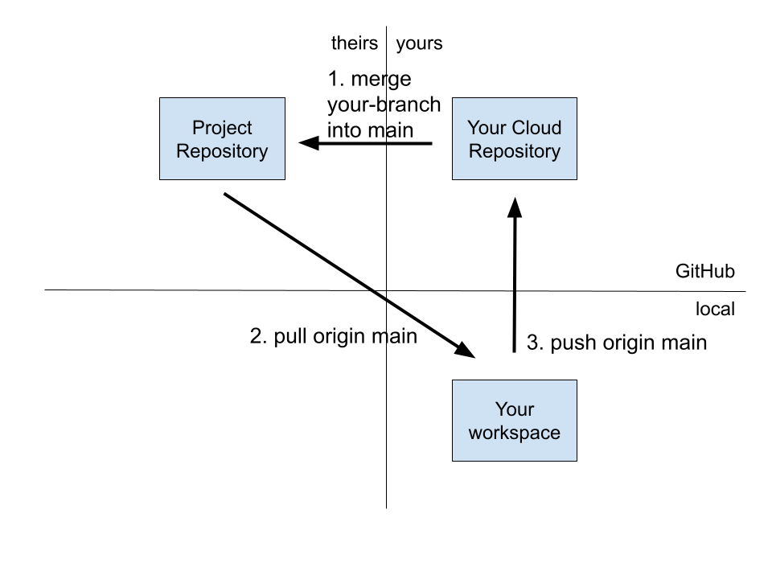

\newpage
# Accept a Pull Request

After reviewing your proposed changes contained in a pull request, the project team may choose to merge your changes contained in a branch of the `origin` repository into the `main` branch of their project repository. This merge is accomplished through the GitHub UI in the browser. Once your code as been incorporated to the project repository, you need to synchronize with that repository.

The following code pulls the most recent code from the `upstream` `main` branch. Remember to push those changes to your `origin` as well, so that your cloud repository stays synchronized with the project repository. You have already seen these three commands {`select`, `pull`, `push`} in previous scenarios:

```bash
git switch main
git pull upstream main
git push origin main
```
## Pull project repository changes to your local repository

