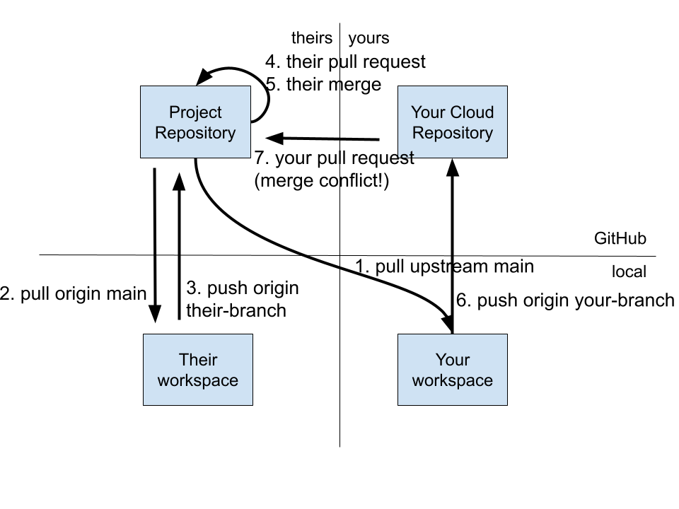

\newpage
# Oh, no! A Merge Conflict!

If you have done any work collaborating with others using GitHub, you have probably encountered a "merge conflict" at one time or another. People who are new to Git are oftened mystified when this happens, because for the most part Git does a fantastic job of merging sets of changes magically with no problems.

When two or more people are working on a code base, eventually two of you will want to make changes to the same section of code in the same file. Suppose your colleague gets their pull request merged first, so their change is merged into the `main` branch. When you come along with your pull request, Git notices that the code has changed since you last pulled `main` and it notices that you are proposing changes to the same lines of code. Therefore, it generates a merge conflict and throws it back to you to integrate your changes with the latest changes that occurred after you last pulled `main`.

The diagram below illustrates that you pull `main` as step (1). Meanwhile, as you are working on your changes, your colleague goes through a full pull, change, add, commit, push, create pull request, merge pull request cycle (steps 2-5 in the diagram). By the time you finally push `your-branch` (6) and create a pull request (7), the `main` branch in the `Project Repository` is no longer the same as the `main` branch in `Your workspace`, so there is a potential for a merge conflict.

## How merge conflicts occur

