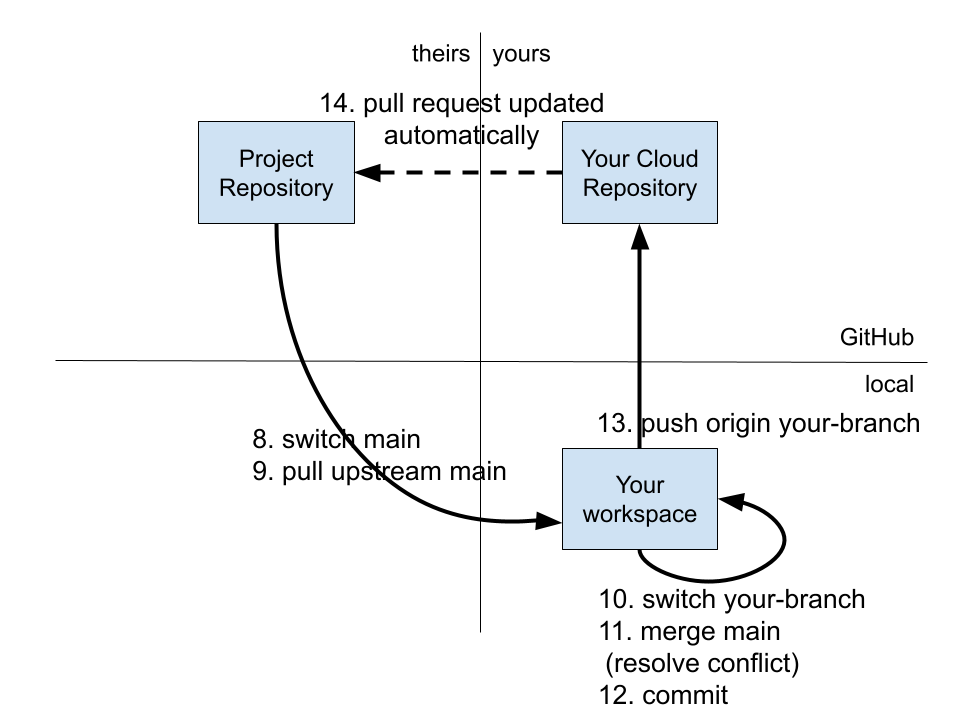

\newpage
# Resolve a Merge Conflict

When GitHub notifies you of a merge conflict, it is a warning that if you were to merge `your-branch` into `main`, the merge would fail with a merge conflict error. Therefore it is up to you to resolve the merge conflict manually, in your workspace.

```bash
git switch main
git pull upstream main  # There is *not* a merge conflict here!
git push origin main  # Keep your cloud repository synchronized
git switch your-branch
git merge main  # Merge main into your-branch. Merge conflict!
# (Change any files that have conflicts.)
git add .
git commit
git push origin your-branch
# GitHub automatically updates your original pull request.
```

At the end of this sequence, your pull request probably does not have a merge conflict, _unless_ another colleague got their pull request approved for the same block of code while you were trying to resolve the first merge conflict. In which case, you go through the process again to fix this next merge conflict.

## Resolve a Merge Conflict

