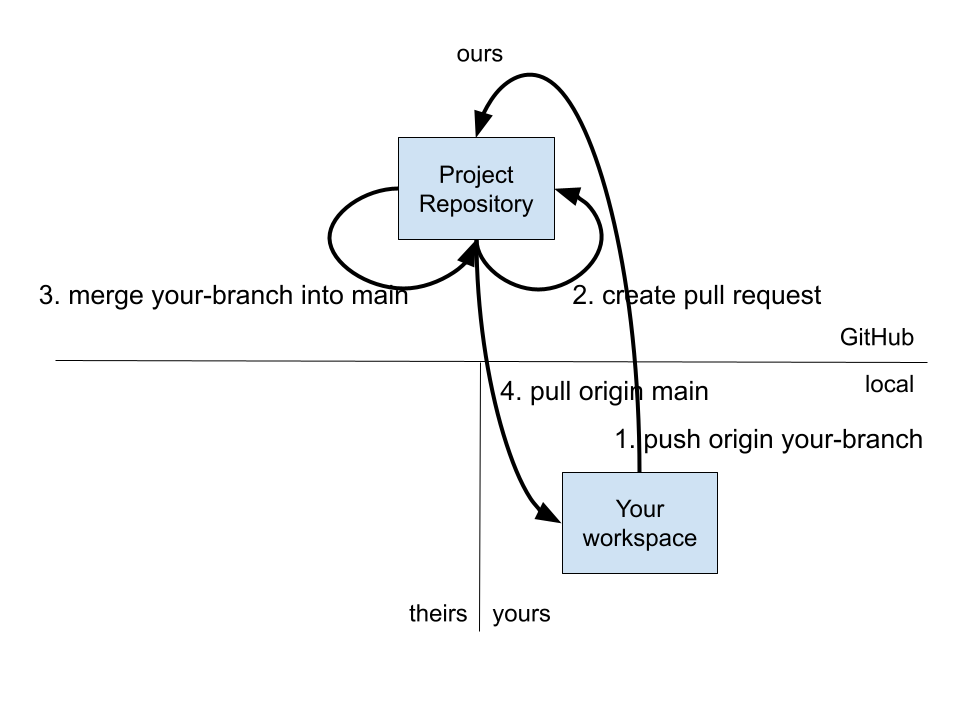

\newpage
# Working as a Committer

When you have permissions to work in the `Project Repository`, then your local workspace only references `origin` without a reference for `upstream`. The rest of the processes that we have considered are fundamentally the same.

The normal flow is:
```bash
git switch main
git pull origin main
git branch your-branch
git switch your-branch
# (Make some changes.)
git add .
git commit
git push origin your-branch
# (Create pull request on GitHub.)
# (Accept pull request on GitHub.)
git switch main
git pull origin main
git branch your-next-branch
# ...
```

## Workflow without a forked repository

